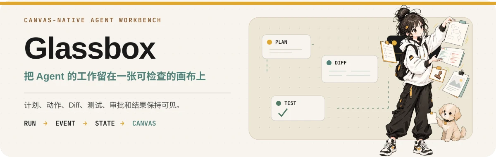

# Glassbox

<p align="center">
  
</p>

Glassbox 是一个以画布为核心的 AI Agent 工作台，用来运行、检查和干预本机上的 Agent。

Agent 的工作不该埋在一条不断滚动的聊天记录里。Glassbox 会把计划、动作、文件、Diff、测试、产物、审批和结果变成画布上的对象。你可以检查、移动、分组、批注，也可以过一段时间再回来继续。

## 为什么要做这个？

短任务用聊天就够了。任务一长，问题就出来了。

Agent 开始读文件、改代码、跑工具、生成 Diff、请求审批、留下各种产物。你很快会忘记它到底做了什么，重要结果夹在几十条消息中间，工具调用也会变成噪音。重新打开一次会话，往往要先滚半天聊天记录，再在脑子里把状态拼回来。

Glassbox 换了一种做法。

画布就是工作区。Agent 的活动先变成结构化状态，其中真正有用的部分再变成画布上的对象。

原始事件仍然可以查看，但不会默认全部变成节点。

Glassbox 也不打算替代你已经在用的 Agent。Provider Adapter 负责连接现有 Agent Runtime，把它们放进同一个工作区，同时保留各自真正有用的能力。

## Glassbox 不是什么

Glassbox 不是在聊天应用旁边加一块白板。

它也不是那种必须先拖节点、搭流程，Agent 才能开始工作的 Workflow Builder。

它更不是一个要求所有 Provider 都长得一样的新 Agent Runtime。

事情没那么复杂。让 Agent 真正跑起来，把它做过的工作留下来，再给人一个能看、能改、能继续指挥的地方。

## 它怎么工作

Web 客户端通过带类型的 HTTP 和 WebSocket Contract 连接本地 TypeScript Runtime。

用户操作先变成 Command。不同 Provider 的 Adapter 负责连接 Codex、Claude Code、Pi、ACP-compatible Agent 和其他 Runtime，再把各自的原生活动转换成 Glassbox Event。

Session Reducer 根据这些 Event 得到当前 Run State。

Canvas Projector 决定哪些状态值得出现在 tldraw Board 上。

```text
Provider
  ↓
Adapter
  ↓
Glassbox Event
  ↓
Session State
  ↓
Canvas Projector
  ↓
tldraw Board
```

画布不是 Agent 执行状态的 Source of Truth。

Board 的布局、分组和用户批注属于工作区。Agent 的执行状态属于 Runtime。刷新浏览器不应该杀掉正在运行的任务。

## 最核心的想法

一次 Agent Run 可能产生几百甚至几千条 Event。

把每一条都扔到画布上会非常糟糕。

Glassbox 会保留需要检查的原始活动，再把真正有用的状态整理成对象，例如：

- 任务和计划
- 值得保留的工具活动
- 文件和 Diff
- 测试结果
- 来源
- 审批
- 产物
- 最终结果
- 用户批注

Object Model 会先保持小。只有真实使用证明需要更多类型时再加。

## 从源码运行

Glassbox 使用 Vite+。

先安装全局 `vp` 命令。

### macOS 和 Linux

```bash
curl -fsSL https://vite.plus | bash
```

### Windows

```powershell
irm https://vite.plus/ps1 | iex
```

安装依赖：

```bash
vp i
```

启动 Web App 和本地 Runtime：

```bash
vp run dev
```

开发环境统一使用相对路径 `/api` 和 `/ws`。不要把 localhost 或固定开发端口写进客户端代码。

每个 worktree 都应该把可写的开发状态放在自己的、被 gitignore 的 `.glassbox/` 目录里。

不要让开发环境或测试指向真实 Glassbox 安装的数据。

## 项目结构

```text
apps/
  server/
  web/

packages/
  contracts/
  shared/
  agent-runtime/

.repos/
docs/
```

`apps/server` 负责本地 Runtime、HTTP 和 WebSocket Transport、Provider Adapter、Session 生命周期和 Event Normalization。

`apps/web` 负责 React 和 Vite+ 应用、tldraw 集成、Board Projection、Inspector、Composer 和用户交互。

`packages/contracts` 放跨进程共享的 Schema、Command、Event Type 和少量 Helper。不要把 Provider 实现或重 Runtime 逻辑塞进这里。

`packages/shared` 只放真正共享的小工具。Keep it boring.

`packages/agent-runtime` 只在多个 App 真的需要共享 Session、Run、Capability 或 Normalized Event 逻辑时再使用。不要因为“以后可能会共享”就提前搬进去。

`.repos/` 放只读的上游参考项目。可以研究，不要修改，也不要让生产代码直接 import 这里的实现。

## 我们在意的几条规则

Provider 的怪脾气留在 Adapter 里。

tldraw 的特殊逻辑留在 Web 的 Projection 和 Rendering 层。

两边都不要漏进核心 Session Model。

不要把每一条原始 Event 都变成节点。

不要给还不存在的 Provider、Client、Protocol 或部署方式提前造抽象。

UI 不能骗人。Spinner 出现时，底层工作必须真的还没结束。Success 出现时，底层状态必须真的已经完成。假的进度、过期的状态文字、没有回滚路径的乐观状态，都算 Bug。

Canvas 在长时间 Agent Run 期间也要保持顺滑。注意大范围 React Re-render、过多的 Live Shape、一直在刷新的视觉效果、超大的 Diff，以及无限增长的 UI State。

成熟实现已经解决好的问题，优先复用。拥有更多代码不是目标。

## 测试

除非你测试的就是 Empty State，否则不要只拿空工作区做测试。

真实 Session、Board、文件和 Agent Run 更容易暴露小 Fixture 看不到的问题。

测试状态留在 worktree 内。需要真实数据时，先复制或 Snapshot 到 worktree。

不要把开发状态软链接到真实状态。

测试 Agent 只能写测试工作区里的路径。

> Copy in. Never point in. Never write back.

修改代码后，用最小但足够证明结果的检查。

默认不要跑整个仓库的检查。只跑和本次改动有关的测试、Lint 和 Typecheck。完整 Suite 交给 CI，除非 Maintainer 明确要求本地跑。

异步测试必须等待真实完成信号或状态变化。不要靠随便 `sleep` 几秒让测试通过。

如果改动涉及 Selection、Grouping、Persistence、Restore、Drag-and-drop 或 Inspector，Canvas 测试既要检查底层状态，也要检查真实 UI 行为。

## Pull requests

除非开发者明确要求，否则不要创建 PR。

Commit 标题使用 Conventional Commit，语言直白：

```text
fix(canvas): restored boards keep node selection
```

PR Body 保持短。先说问题，再说怎么修。

UI 改动需要 Before 和 After 图片。涉及 Motion、Timing 或 Drag-and-drop 时，需要一个短视频。

一个 PR 只做一件事。如果描述里开始出现 "also" 或 "while here"，拆开。

盯一个已经打开的 PR 时，只处理最后一次 Push 之后新增的 Check 和 Comment。Bot 的发现先回到源码验证，再决定要不要改。真的问题就修，误报就解释清楚。

没新东西就别动。

最新 Commit 全绿以后就停。

## 文档

项目文档放在 `docs/`。

```text
docs/
  user/
  internals/
  operations/
```

用户能感知到的行为写进 `docs/user/`。

架构和贡献者说明写进 `docs/internals/`。

运维步骤写进 `docs/operations/`。

共享术语统一放在：

```text
docs/internals/glossary.md
```

如果你要修改 Glassbox 本身，先读 `AGENTS.md`。

## 当前状态

Glassbox 还很早。

Canvas Model、Provider Adapter、Persistence 规则和交互方式都会在真实使用中继续变化。

这反而更需要现在把系统保持小。

只做当前问题真的需要的东西。做出来，测一下，留下有效的。不要为一个还不存在的 Glassbox 版本提前把仓库塞满架构。
