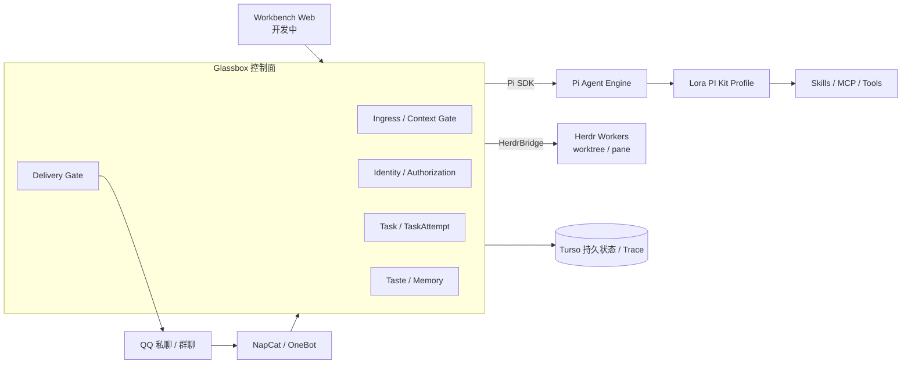
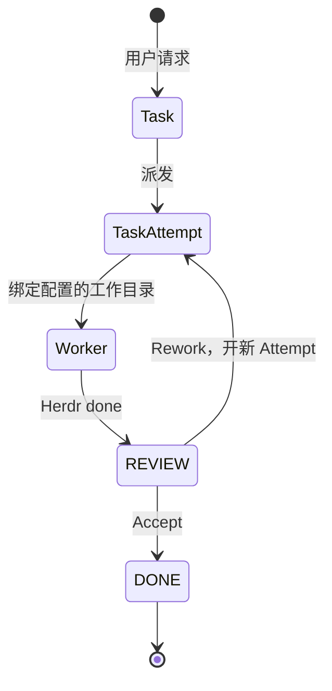

# Glassbox

<p align="center">
  
</p>

<p align="center">
  <a href="./LICENSE"></a>
  <a href="https://nodejs.org/"></a>
  <a href="https://vite.dev/"></a>
  <a href="./.plans/roadmap.md"></a>
</p>

---

Glassbox 是一个 Personal Agent 系统：显式身份、严格授权、持久化会话、可审查执行、任务闭环。

你通过 QQ、Workbench（开发中）和同一个主 Agent 对话。它可以直接回答，也可以把需要真实执行的工作登记成 Task，交给 Herdr 里的 Pi、Codex、Claude Code 等 coding worker。Glassbox 管的是产品真相：身份、权限、Conversation、Task、Taste、Memory、Trace，以及每一条结果能不能发给当前 Audience。

## 已经能跑的能力

以下能力已合入 main，有确定性测试和真实验收覆盖：

- **QQ 私聊与群聊接入**。NapCat / OneBot 通道，支持群管理员的原生授权。
- **四道服务端硬 Gate**。Ingress、Context、Tool / Ops、Delivery 依次把关，权限只有 ALLOW、DENY、REQUIRES_APPROVAL 三种结果，没有显式 Grant 一律 DENY。
- **Task 生命周期闭环**。派发给 Herdr coding worker 时使用已配置的 workspace 和 worktree；worker 完成后必须经过人工 Review，Accept 才算 DONE，Rework 则开新的 TaskAttempt。当前不会按 Task 自动创建独立分支或 worktree。
- **Taste / Memory 持久学习**。受治理的学习真相落库，不是写在 prompt 里的口头记忆。
- **授权检索**。QQ 历史消息搜索，引用必须来自官方来源。
- **上下文预算与运行时路由**。按任务和 Audience 控制注入的上下文与技能面。
- **双 Owner 协同**。主 Owner 与协同 Owner 身份对等，私聊会话在数据库中物理隔离。当前固定的 worker 配置不提供按 Task 的 worktree 隔离，并发编码任务不能依赖此路径避免互相踩踏。

Web 管理端和 P6 长任务还在开发中，见[当前开发状态](#当前开发状态)。

## 系统架构


```mermaid
flowchart LR
    QQ[QQ 私聊 / 群聊] --> OB[NapCat / OneBot]
    WB[Workbench Web<br/>开发中] --> GB
    OB --> GB

    subgraph GB[Glassbox 控制面]
        direction TB
        G1[Ingress / Context Gate]
        G2[Identity / Authorization]
        G3[Task / TaskAttempt]
        G4[Taste / Memory]
        G5[Delivery Gate]
    end

    GB -- Pi SDK --> PI[Pi Agent Engine]
    PI --> KIT[Lora PI Kit Profile]
    KIT --> T[Skills / MCP / Tools]
    GB -- HerdrBridge --> H[Herdr Workers<br/>worktree / pane]
    GB --> DB[(Turso 持久状态 / Trace)]
    G5 --> QQ
```

| 组件 | 角色 | 职责 |
| :--- | :--- | :--- |
| Glassbox | Personal Agent 系统 | 产品真相：身份、权限、会话、Task、Taste、Memory、Trace、投递决策 |
| Pi | Agent Engine | Agent loop、会话、模型接入、SDK。Glassbox 通过 `@earendil-works/pi-coding-agent` SDK 嵌入 |
| Lora PI Kit | Pi Distribution | 把裸 Pi 一次安装成完整工作环境：技能快照、扩展、MCP 适配、Profiles、兼容锁 |
| Herdr | Coding Worker 宿主 | 执行现场：Workspace、Worktree、Pane、终端进程 |
| Channel | 接入端点 | QQ、Workbench、API 等外部入口，不是独立 Agent |
| Canvas | Projection | 可视化检查面，不是执行状态真相 |

要点：Channel 只是入口，Pi 是引擎，Kit 是分发，Herdr 是执行现场。Glassbox 才是 Personal Agent 系统，这些产品真相不能被 Pi Profile、Skill、MCP 或模型输出替代。

## 权限是硬边界

权限不靠 prompt。Authorization 只有三种确定性结果：

```text
ALLOW / DENY / REQUIRES_APPROVAL
```

没有明确 Grant 就是 DENY。每一次受保护操作都要能回答 Who、Where、What、How、Resource、Audience、Conversation、Run / Task。

核心原则是**能读不等于能发**。Owner 在私聊能读取自己的私人数据，不代表这些数据可以发进 QQ 群。以下概念相互独立：

```text
Conversation ≠ Pi Session
Pi Session ≠ Run
Task ≠ Run
Task ≠ Worker
TaskAttempt ≠ Herdr pane
Herdr state ≠ Task acceptance
```

## Agent Operations

Glassbox 与 Herdr 双向通信：下行在已配置的 workspace / worktree 中启动 Agent、授权跟进或取消；上行回报 workspace / pane 变化、working / blocked / done、worker 掉线与恢复。Glassbox 当前不会为每个 Task 创建分支或 worktree；固定的 worker 配置不能作为并发编码任务的隔离保证。


```mermaid
stateDiagram-v2
    [*] --> Task: 用户请求
    Task --> TaskAttempt: 派发
    TaskAttempt --> Worker: 绑定配置的工作目录
    Worker --> REVIEW: Herdr done
    REVIEW --> DONE: Accept
    REVIEW --> TaskAttempt: Rework，开新 Attempt
    DONE --> [*]
```

> [!IMPORTANT]
> Herdr agent = done 不等于 Glassbox Task = DONE。正常路径必须经过 REVIEW，Accept 或 Rework 由人决定。

## 当前开发状态

| 阶段 | 内容 | 状态 |
| :--- | :--- | :--- |
| P3 | QQ Personal Agent + Agent Ops 闭环 | 已完成 |
| P4A | Taste / Memory 持久学习真相 | 已完成 |
| P4B | 授权检索与 QQ 历史搜索 | 已完成 |
| P5A / P5B | 上下文预算、运行时路由与可观测性 | 已完成 |
| Web 管理端 | Workbench 与管理界面（design freeze v2） | 开发中 |
| P6 | 持久长任务与 Worker | 开发中 |
| P7 / P8 | 更多 Channel、评测、技能演化 | 规划中 |

完整 Roadmap 见 [`.plans/roadmap.md`](./.plans/roadmap.md)，各阶段施工顺序与验收证据见 [`.plans/`](./.plans/) 下对应的 plan 文件。

## 快速开始

环境要求：

- Node.js >= 24.12.0，npm 12.0.2
- 统一工具链 Vite+，命令入口 `vp`
- 真实 QQ 收发验收需要 NapCat / OneBot
- 配置 coding Worker 需要 Herdr；使用 `pi:*` Runtime 的 Channel 需要 Lora PI Kit

```bash
git clone https://github.com/lora-sys/Glassbox-Agent-Harness.git
cd Glassbox-Agent-Harness

# 安装依赖
vp install

# 运行提交门禁
vp run verify:commit
```

服务进程管理（Windows 下不要用 `vp run agent:up` 管理长驻服务）：

```bash
npm run agent:up      # 启动
npm run agent:status  # 状态与健康度
npm run agent:logs    # 实时日志
npm run agent:down    # 停止
```

启动器只负责启动 Glassbox，`service-launch.json` 里配置了 NapCat 或 Herdr 才会一并启动。它不会自动拉代码、切分支、装依赖或写凭据。QQ、NapCat、模型凭据不要进 `.env`、启动命令或版本库，通过 Glassbox 管理界面或 CLI 保存。配置格式见 [`docs/service-launch.example.json`](./docs/service-launch.example.json)。

已有工作树更新时，先确认工作区干净、分支正确，再 fast-forward：

```bash
git status --short --branch
git fetch origin
git pull --ff-only   # 仅在工作区干净且分支目标正确时执行
vp install
vp run verify:commit
```

## 文档索引

| 文档 | 说明 |
| :--- | :--- |
| [`AGENTS.md`](./AGENTS.md) | 项目稳定不变量与核心准则，进仓库先读这个 |
| [`.plans/roadmap.md`](./.plans/roadmap.md) | 产品 Roadmap 与阶段顺序 |
| [`docs/runtime-strategy.md`](./docs/runtime-strategy.md) | Runtime 归属权与 Pi SDK 边界 |
| [`docs/lora-pi-kit.md`](./docs/lora-pi-kit.md) | Lora PI Kit 规范与 Profiles 体系 |
| [`docs/agent-operations.md`](./docs/agent-operations.md) | Herdr、Task、Worker 协调机制 |
| [`docs/memory-taste.md`](./docs/memory-taste.md) | Rules、Skills、Taste 与 Memory 体系 |
| [`docs/owner-pi-sandbox.md`](./docs/owner-pi-sandbox.md) | Owner Pi 沙箱 |
| [`docs/tech-stack.md`](./docs/tech-stack.md) | 技术栈、Vite+ 工具链与部署规范 |
| [`docs/data-observability.md`](./docs/data-observability.md) | 持久化数据、存储与可观测性 |
| [`docs/ui-design.md`](./docs/ui-design.md) | Workbench UI 设计 |
| [`upstream/*/SOURCES.md`](./upstream/) | 上游调研与来源说明 |

进入本仓库工作的 Coding Agent 按此顺序阅读：

```text
AGENTS.md
→ 当前 Active Plan（.plans/ 下对应文件）
→ 当前任务对应 docs/*.md
→ 相关 upstream notes
→ production code + focused tests
```

## 开源协议

MIT。详见 [`LICENSE`](./LICENSE)。
